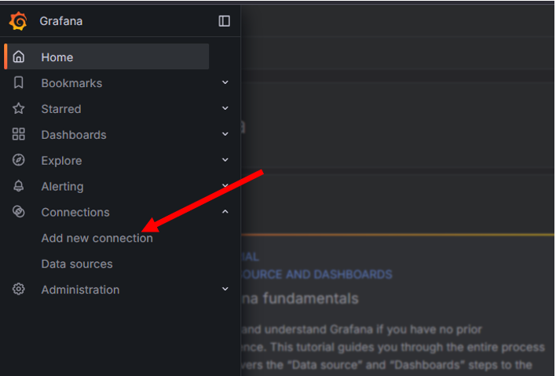
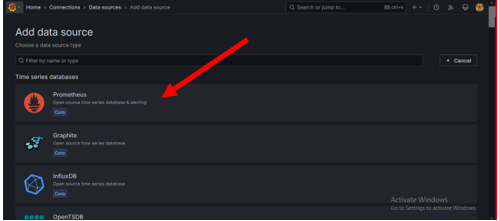
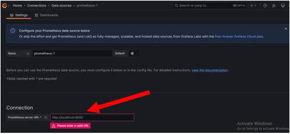
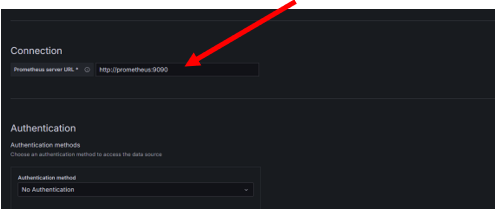

# Monitoring Flask App with Prometheus, Node Exporter, and Grafana

## Overview
This documentation outlines the setup for monitoring a Flask application using Prometheus, Node Exporter, and Grafana in a Dockerized environment.

## Project Structure
```
project/
│── docker-compose.yml
│── prometheus.yml
│── .env
│── app/
│   │── app.py
│   │── Dockerfile
│   │── requirements.txt
```

## Prerequisites
- Docker & Docker Compose installed
- Basic knowledge of Flask & Prometheus

## 1. Flask Application (`app.py`)
This Flask app exposes a `/metrics` endpoint secured with a bearer token. It tracks endpoint hits, response times, and user locations.

### Key Features:
- Uses Prometheus client for monitoring.
- Implements authentication for the `/metrics` endpoint.
- Captures errors and latency.

## 2. Environment Variables (`.env`)
```
PROMETHEUS_HEX=your_hex_key_here
```

## 3. Flask Dockerfile (`Dockerfile`)
```dockerfile
FROM python:3.9
WORKDIR /app
COPY requirements.txt ./
RUN pip install --no-cache-dir -r requirements.txt
COPY . .
CMD ["python", "app.py"]
```

## 4. Prometheus Configuration (`prometheus.yml`)
```yaml
global:
  scrape_interval: 5s

scrape_configs:
  - job_name: "prometheus"
    static_configs:
      - targets: ["prometheus:9090"]

  - job_name: "node_exporter"
    static_configs:
      - targets: ["node_exporter:9100"]

  - job_name: "flask_app"
    scrape_interval: 5s
    metrics_path: '/metrics'
    static_configs:
      - targets: ["flask_app:5001"]
    scheme: http
    bearer_token: ${PROMETHEUS_HEX}
```

## 5. Docker Compose (`docker-compose.yml`)
```yaml
version: '3.8'

services:
  flask_app:
    build: ./app
    container_name: flask_app
    restart: always
    ports:
      - "5001:5001"
    networks:
      - monitoring
    env_file:
      - .env

  prometheus:
    image: prom/prometheus:latest
    container_name: prometheus
    volumes:
      - ./prometheus.yml:/etc/prometheus/prometheus.yml
    ports:
      - "9090:9090"
    networks:
      - monitoring

  node_exporter:
    image: prom/node-exporter:latest
    container_name: node_exporter
    restart: always
    ports:
      - "9100:9100"
    networks:
      - monitoring

  grafana:
    image: grafana/grafana:latest
    container_name: grafana
    restart: always
    ports:
      - "3000:3000"
    networks:
      - monitoring

networks:
  monitoring:
    driver: bridge
```

## 6. Running the Setup
```sh
docker-compose up -d --build
```

## 7. Accessing the Services
- Flask App: `http://localhost:5001`
- Prometheus: `http://localhost:9090`
- Node Exporter: `http://localhost:9100/metrics`
- Grafana: `http://localhost:3000`

## 8. Setting Up Grafana
1. Open `http://localhost:3000`
---

---
2. Login with default credentials: `admin/admin`
---

---
3. Add a new data source → Select `Prometheus`
---

---

---

---
4. Set `http://prometheus:9090` as the Prometheus URL
---

--- 

--- 
5. Save & test
---

--- 
6. Import dashboards for visualizations
---

--- 
---

--- 

--- 

--- 

--- 
## 9. Stopping the Containers
```sh
docker-compose down
```

## Conclusion
This setup allows real-time monitoring of a Flask application, including request counts, response times, and system metrics, using Prometheus, Node Exporter, and Grafana.
